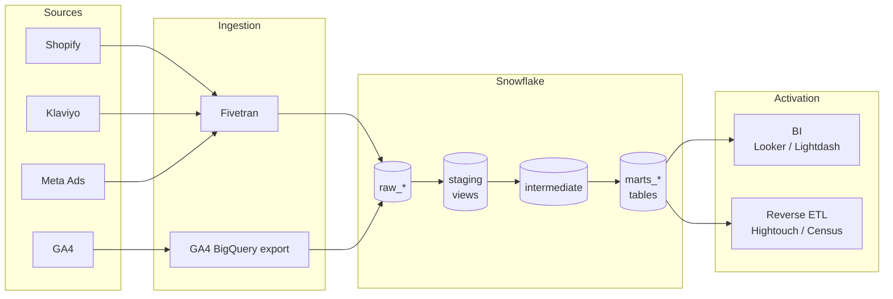

# Modern D2C Data Stack — Reference Implementation

A production-grade **dbt** project that turns the four data sources every D2C
brand actually has — **Shopify, Klaviyo, Meta Ads, GA4** — into the metrics an
operator runs the business with: blended ROAS, contribution-margin CAC, LTV by
acquisition cohort, payback period, retention curves.

> **Live dashboards** — same dbt marts, two presentation layers:
> - [`d2c-data-stack.streamlit.app`](https://d2c-data-stack.streamlit.app/) — Streamlit, light/executive theme, Altair charts. Source in [`streamlit_app/`](streamlit_app/).
> - [`amanimulira.github.io/D2C-Data-Stack`](https://amanimulira.github.io/D2C-Data-Stack/) — Evidence, static SvelteKit build on GitHub Pages. Source in [`bi/`](bi/).
>
> Every chart on every page is one SQL query against a documented, tested mart — nothing pre-aggregated, nothing hidden.

| | |
|---|---|
| **Stack** | dbt-core · Snowflake (prod) · DuckDB (local + CI) · Fivetran · GA4 → BigQuery → Snowflake replication |
| **Sources modeled** | Shopify, Klaviyo, Meta Ads, GA4 |
| **Models** | 30+ (`staging` → `intermediate` → `marts/{core,marketing,customer}`) |
| **Tests** | 100+ (schema · `dbt-expectations` distributional · custom singular · source freshness) |
| **CI** | GitHub Actions runs `dbt build` against DuckDB on every PR — no warehouse credentials required |
| **BI** | Two dashboards over the same marts — [Streamlit](https://streamlit.io) (executive theme, Altair charts) on Streamlit Community Cloud, and [Evidence](https://evidence.dev) (static SvelteKit) on GitHub Pages |
| **Runs locally** | `dbt build` end-to-end in <60s on DuckDB. Synthetic seeds included. |

> Built as a credibility-grade reference — fork it, clone it, ship it. Every
> SQL file has a purpose, every column is documented, every assumption is
> explicit.

---

## Why this exists

D2C operators ask the same five questions every Monday:

1. How much did we make this week, and how much did it cost us to make it?
2. Where are new customers coming from, and what does it cost to acquire them?
3. Are the customers we acquired three months ago still buying?
4. Which channel mix should I lean into, and which is over-reporting?
5. Of every dollar in revenue, how much actually drops to contribution margin?

The data to answer them lives in five separate clouds — Shopify, Klaviyo, Meta,
Google, GA4 — none of which agree with each other. This repo is the modeling
layer that **reconciles them into a single, opinionated, audit-able truth** that
a CFO, a CMO, and a paid-media buyer can all argue from the same numbers in.

---

## What you get

The dbt project produces these mart tables. Every one is documented, tested,
and ready to point a BI tool at.

| Mart | Grain | What it answers |
|---|---|---|
| `dim_customers` | One row / customer | Who, where, lifetime value, acquisition channel, repeat status. |
| `dim_products` | One row / SKU | Catalog with COGS and unit margin pre-computed. |
| `dim_dates` | One row / day | Calendar spine for cohort & time-series joins. |
| `fct_orders` | One row / order | The order graph. Refund-net revenue, summed COGS, contribution margin. **Incremental.** |
| `fct_order_items` | One row / line | Product-mix and per-SKU margin. |
| `fct_marketing_performance` | Daily × campaign | Spend with both platform-reported and last-touch ROAS side by side. |
| `fct_attribution_first_touch` | One row / order | Each order credited to the customer's *first-order* UTM. The acquisition view. |
| `fct_attribution_last_touch` | One row / order | Each order credited to its own UTM. The conversion view. |
| `fct_blended_roas` | Daily | Total revenue / total paid spend (MER) — the only honest top-line marketing metric. |
| `customer_ltv` | One row / customer | Cumulative revenue & margin at 30/60/90/180/365-day windows. |
| `customer_cohort_retention` | Cohort month × month-since-acquisition | Retention matrix with retention rate. |
| `customer_rfm` | One row / customer | RFM scores 1–5 with named lifecycle segments — drops into Klaviyo. |

Plus two ready-to-paste analyses:

- `analyses/monthly_business_review.sql` — Monday-morning headline numbers.
- `analyses/cohort_payback_curve.sql` — cumulative margin/customer × cohort, with
  payback ratio per month.

For metric definitions and the formulas, see [`docs/business_metrics.md`](docs/business_metrics.md).

---

## Architecture



Layer-by-layer detail in [`docs/architecture.md`](docs/architecture.md).

---

## Quickstart — runs in &lt;60s on your laptop

You don't need a Snowflake account. The repo ships with synthetic CSV seeds and
a DuckDB target so you can clone, build, and inspect the marts immediately.

```bash
git clone https://github.com/amanimulira/D2C-Data-Stack.git
cd D2C-Data-Stack

python -m venv .venv && source .venv/bin/activate
pip install -r requirements.txt

# Point dbt at the example profile (DuckDB, no creds needed)
export DBT_PROFILES_DIR="$(pwd)"
cp profiles.yml.example profiles.yml

dbt deps          # install dbt-utils, dbt-expectations, codegen
dbt seed          # load 10 customers, 30 orders, 89 Klaviyo events, 267 Meta insights, 277 GA4 events
dbt build         # run all models + every test
```

You'll have a `d2c_stack.duckdb` file in the working directory. Open it with
the [DuckDB CLI](https://duckdb.org/docs/installation/) or any DBeaver-style
client and explore the marts.

```sql
-- Sanity check: blended ROAS for the seed period
select date_day, total_revenue, total_spend, blended_roas
from marts_marketing.fct_blended_roas
where total_revenue > 0
order by date_day;
```

### Running against Snowflake

Switch the target in `profiles.yml`:

```bash
export SNOWFLAKE_ACCOUNT=...
export SNOWFLAKE_USER=...
export SNOWFLAKE_PASSWORD=...
dbt build --target snowflake
```

Schemas (`raw_*`, `staging`, `intermediate`, `marts_*`) materialize verbatim in
the configured database. The `generate_schema_name` macro is overridden so you
don't end up with `dbt_dev_raw_shopify`-style nested names.

---

## Project structure

```
D2C-Data-Stack/
├── dbt_project.yml                  Project config: schemas, materializations, vars
├── packages.yml                     dbt-utils, dbt-expectations, codegen
├── profiles.yml.example             DuckDB + Snowflake target examples
├── requirements.txt
├── seeds/                           Synthetic CSVs — runnable demo data
├── macros/                          normalize_email, cents_to_dollars, unioned_marketing_spend, ...
├── models/
│   ├── staging/                     stg_<source>__<entity> — column rename, type cast, normalize
│   │   ├── shopify/                 orders, order_lines, customers, products, refunds
│   │   ├── klaviyo/                 events, campaigns, flows, profiles
│   │   ├── meta_ads/                campaigns, ad_sets, ads, ad_insights
│   │   └── ga4/                     events, sessions
│   ├── intermediate/                int_orders__joined, int_marketing__unified_spend, ...
│   └── marts/
│       ├── core/                    dim_customers, dim_products, dim_dates, fct_orders, fct_order_items
│       ├── marketing/               fct_marketing_performance, fct_attribution_*, fct_blended_roas
│       └── customer/                customer_ltv, customer_cohort_retention, customer_rfm
├── tests/                           Custom singular tests (assertions)
├── analyses/                        monthly_business_review, cohort_payback_curve
├── docs/                            Architecture, modeling, business metric formulas
├── bi/                              Evidence dashboard — static SvelteKit, GitHub Pages
├── streamlit_app/                   Streamlit dashboard — light/executive theme, Altair
└── .github/workflows/
    ├── ci.yml                       dbt build on every PR
    └── deploy-evidence.yml          dbt build + Evidence build → GitHub Pages on push to main
```

---

## Quality & testing

Tests aren't decoration — they're the contract that lets a downstream BI dashboard
trust a number. This project ships with all four kinds dbt supports.

| Type | Count | Examples |
|---|---|---|
| **Schema tests** (declared in YAML) | ~70 | `unique`, `not_null`, `accepted_values`, `relationships`, `dbt_utils.unique_combination_of_columns` |
| **Distributional tests** (`dbt-expectations`) | ~15 | `0 ≤ ctr ≤ 1`, `0 ≤ retention_rate ≤ 1`, `spend ≥ 0`, `contribution_margin_pct ∈ [-1, 1]` |
| **Singular tests** (in `tests/`) | 4 | `assert_no_future_orders`, `assert_positive_revenue`, `assert_attribution_coverage`, `assert_cohort_retention_in_bounds` |
| **Source freshness** | per-source SLA | `warn_after: 6h`, `error_after: 24h` for Shopify; longer thresholds for batch sources. Catches upstream pipeline failures before they corrupt downstream marts. |

Every test runs in CI on every PR via `dbt build`.

---

## Why this stack

**Snowflake** for storage + compute. Cheaper than BigQuery at D2C-scale workloads,
better RBAC primitives for separating analyst access from production schemas,
and the dialect everyone hires for. Use BigQuery if you're already on Google
Cloud or if cost-per-query sensitivity wins out.

**dbt** as the transformation layer. Non-negotiable for analytics engineering in
2026. Tests, lineage, docs, and a hiring market that already knows it.

**Fivetran** as the default ingestion tool. Boring is good — it just works for
Shopify, Klaviyo, and Meta. Airbyte / Estuary / Stitch all work too; the source
schemas in `_<source>__sources.yml` are connector-agnostic so swapping is a
schema-rename, not a rewrite.

**GA4 → BigQuery → Snowflake replication** because GA4 has no native Snowflake
destination. The BigQuery export is GA4's only complete event stream; replicating
to Snowflake (Hightouch, Census, or a custom Airflow job) is the canonical path.

**DuckDB** for local dev and CI. Same SQL dialect close enough to Snowflake's
for 95% of staging models, runs in-process with zero infra, makes the project
clonable and runnable in <60 seconds. Production never touches it — but every
PR does.

---

## Production considerations

This is a reference implementation, not a turnkey deployment. Here's what graduating
to production looks like:

- **Orchestration.** Replace the local `dbt build` with a scheduler — dbt Cloud,
  Dagster, or Airflow. dbt Cloud is the lowest-effort; Dagster wins if you also
  orchestrate Python ETL or Hightouch syncs.
- **Environment promotion.** `dev` → `ci` → `prod` via target switching. The
  `generate_schema_name` macro is configured to keep schemas predictable across
  targets; pair with separate Snowflake roles per env.
- **Slowly-changing dimensions.** `dim_customers` is currently Type 1. Promote
  to Type 2 (`dbt snapshot`) once you start needing historical attribute
  changes — e.g., did the customer accept marketing *at the time of* the order?
- **Reverse ETL.** Pipe `customer_rfm.rfm_segment` into Klaviyo segments via
  Hightouch. This closes the loop: warehouse drives lifecycle marketing.
- **Identity resolution.** The GA4 → Shopify customer stitch in this repo is
  intentionally simple (date + UTM match). Production-grade stitching writes
  `customer_id` to GA4 as a `user_id` event after login or purchase, then
  joins on `user_pseudo_id` deterministically.
- **Cost monitoring.** Query-tag every dbt model so warehouse spend can be
  attributed to specific marts. Already configured in `profiles.yml.example`
  via `query_tag: dbt-d2c-stack`.
- **PII.** The schema YAMLs flag email and phone with `meta: { contains_pii: true }`.
  Pair with Snowflake dynamic data masking policies so analyst-tier roles
  see hashed identifiers.

---

## About

I build modern data stacks for D2C brands — Shopify-native, full-funnel
attribution, contribution-margin economics, in production in 4–6 weeks.

If you're a Head of Data, CMO, or founder reading this and your dashboards
disagree with each other, [reach out](https://github.com/amanimulira).

For questions or contributions on this repo, open an issue or PR.

## License

MIT — see [LICENSE](LICENSE). Use any part of this for client work, internal
demos, or learning. Attribution appreciated, not required.
