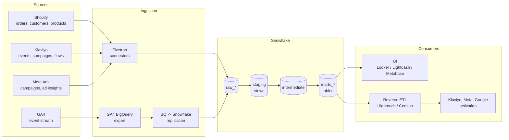

# Architecture

## Stack diagram



## Why this shape

**Three-layer dbt project (staging, intermediate, marts).** Standard dbt Labs
convention. Staging owns column renaming, type casting, and source-specific
cleanup. Intermediate owns the heavy joins and rollups that feed multiple marts.
Marts are the public, BI-facing surface — clean grain, business-friendly column
names, every column documented and tested.

**Schema-per-domain in marts.** `marts_core` (the order graph), `marts_marketing`
(spend, attribution, ROAS), `marts_customer` (LTV, cohorts, RFM). BI users see a
schema list that maps to a mental model, not a flat dump of tables.

**One dim, many facts.** `dim_customers` and `dim_products` are the join
ground for every fact; `fct_orders` is the order-grain truth, `fct_order_items`
the line-grain truth, `fct_marketing_performance` the daily channel truth.

## Ingestion patterns

| Source | Tool | Schema | Cadence | Notes |
|---|---|---|---|---|
| Shopify | Fivetran Shopify connector | `raw_shopify` | 15 min | Default Fivetran schema; we don't reshape it pre-warehouse. |
| Klaviyo | Fivetran Klaviyo connector | `raw_klaviyo` | 1 hour | Event stream is the primary table; profiles are a slowly-changing snapshot. |
| Meta Ads | Fivetran Facebook Ads connector | `raw_meta_ads` | 6 hours | Insights backfill 28 days on each sync to capture late-attributed conversions. |
| GA4 | BigQuery export → Snowflake | `raw_ga4` | Daily | GA4 doesn't have a native Snowflake destination; we replicate the BQ daily export tables. |
| Reference | dbt seeds | `raw_reference` | Manual | Country lookups and other rarely-changing reference tables. |

## Source freshness SLAs

Defined in each `_<source>__sources.yml`. Stale source data is a leading
indicator of pipeline failure, more reliable than dbt run failures (which only
fire after the next scheduled run). On Snowflake, `dbt source freshness` runs
on a schedule independent of the build.

## Warehouse layout

```
ANALYTICS database
├── raw_shopify, raw_klaviyo, raw_meta_ads, raw_ga4   -- Fivetran / replication target
├── staging                                            -- views over raw, no compute cost
├── intermediate                                       -- ephemeral; inlined into marts
├── marts_core                                         -- dim_customers, fct_orders, ...
├── marts_marketing                                    -- attribution, ROAS, blended ROAS
└── marts_customer                                     -- LTV, cohorts, RFM
```

The `generate_schema_name` macro is overridden to materialize each layer into
its declared custom schema verbatim, instead of dbt's default
`<target_schema>_<custom_schema>` concatenation.

## Production considerations

- **Incremental builds.** `fct_orders` is incremental on `processed_at` to
  catch refunds against historical orders. Other facts are full-refresh because
  the seed volume is small; in production, consider incremental for any fact
  exceeding ~10M rows.
- **Slowly-changing dimensions.** `dim_customers` is currently Type 1 (no
  history). The product and customer marts should graduate to Type 2 snapshots
  once attributes start changing meaningfully (e.g., customer email opt-in
  status, product price changes).
- **Identity stitching.** GA4 sessions → Shopify customers is the canonical
  D2C stitch problem. The reference implementation joins on
  `(date, utm_source, utm_medium, utm_campaign)`; in production, instrument the
  storefront to write `customer_id` to GA4 as a `user_id` event after login or
  purchase, then stitch `user_pseudo_id` → `user_id` deterministically.
- **PII.** Email and phone columns are tagged `meta: { contains_pii: true }` in
  schema YAMLs. Combine with Snowflake masking policies / dynamic data masking
  for analyst-tier roles.
- **CI/CD.** GitHub Actions runs `dbt build` against DuckDB on every PR — fast,
  zero-secret, no Snowflake spend. Production runs go through a deployment
  service (dbt Cloud, Dagster, Airflow) with secrets-managed Snowflake auth.
